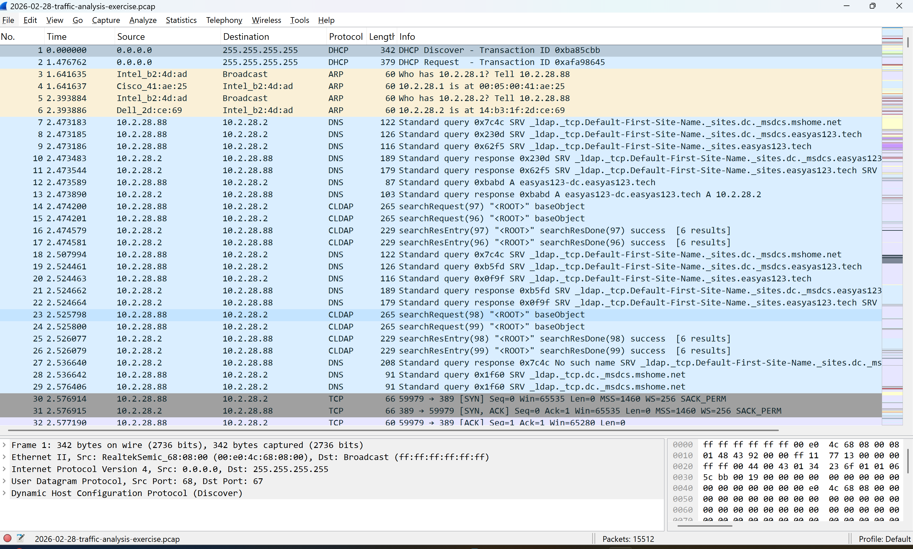
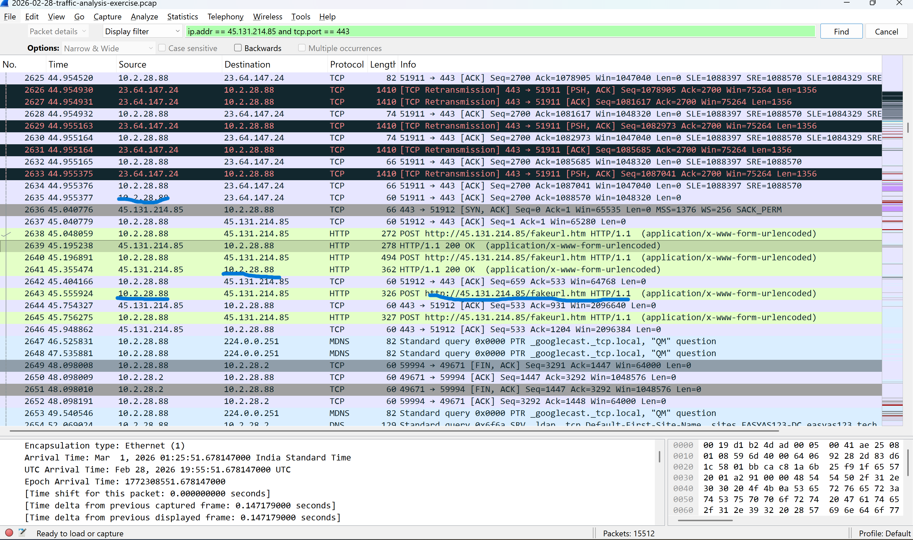
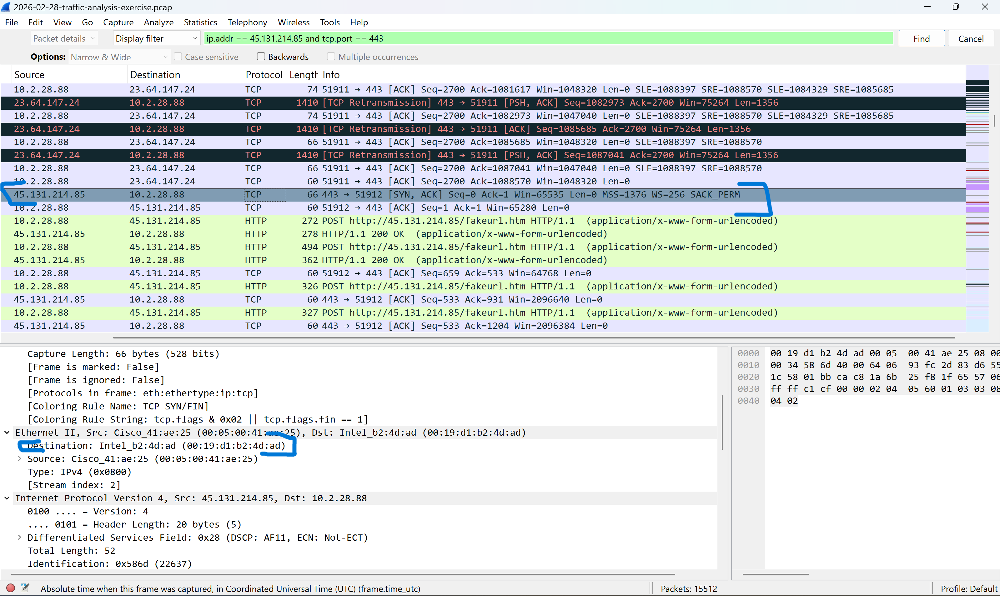
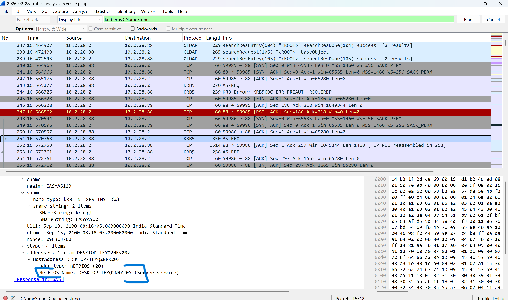
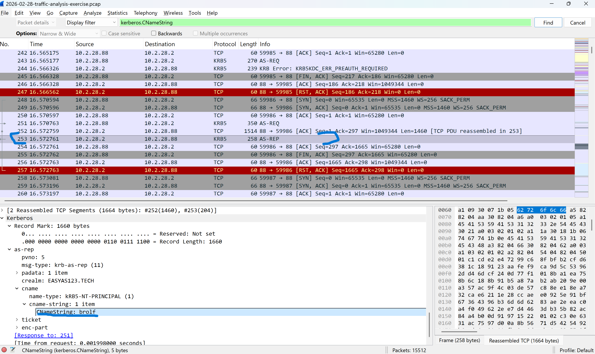

## Investigation Walkthrough

The investigation was performed using a structured traffic analysis workflow in Wireshark.

---

### Step 1: Download and Extract PCAP File

The traffic sample was downloaded from:

https://www.malware-traffic-analysis.net/2026/02/28/index.html

After downloading the compressed archive, the PCAP file was extracted using the provided password.

Password:
```text
infected_20260228
```

Once extracted, the PCAP file was opened in Wireshark for analysis.



---

### Step 2: Review Incident Scenario

The provided incident scenario indicated SIEM alerts for:

- **NetSupport Manager RAT**
- External IP: **45.131.214.85**
- Destination Port: **443/TCP**

This immediately gave a strong starting point for traffic filtering.

---

### Step 3: Filter Suspicious Traffic

To isolate traffic related to the suspicious IP and port, the following Wireshark filter was applied:

```bash
ip.addr == 45.131.214.85 and tcp.port == 443
```

This filter displays all packets communicating with the malicious infrastructure over TCP 443.

### Observation
The filtered traffic showed communication between:

- External IP: **45.131.214.85**
- Internal IP: **10.2.28.88**

This strongly suggested that internal host **10.2.28.88** was the infected endpoint.

### Result
**Infected Windows Client IP:** `10.2.28.88`

---


---

### Step 4: Identify Suspicious Web Activity

Further inspection of the filtered traffic revealed communication with the following suspicious URL:

```text
http://45.131.214.85/fakeurl.html
```

This indicates possible malware staging, payload delivery, or RAT-related communication.

### Result
**Suspicious URL Identified**

---



---

### Step 5: Identify MAC Address

To identify the physical device associated with the infected host, TCP handshake packets were inspected.

The **[SYN, ACK]** packet was selected to inspect Layer 2 details.

From packet analysis:

### Result
**MAC Address:** `00:19:d1:b2:4d:ad`

This identifies the hardware interface of the compromised machine.

---



---

### Step 6: Identify Hostname

To discover the system hostname, Kerberos traffic was analyzed.

Applied filter:

```bash
kerberos.CNameString
```

Kerberos authentication traffic revealed the hostname inside packet details.

### Result
**Hostname:** `DESKTOP-TEYQ2NR`

This helps associate the infected IP with a specific workstation.

---



---

### Step 7: Identify User Account

Continuing analysis of Kerberos packets revealed associated user authentication details.

The following user account was observed:

### Result
**User Account:** `brolf`

Based on observed naming convention:
- **b** → first name initial
- **rolf** → surname

This helps attribute activity to a specific user account.

---



---

### Step 8: Extract Indicators of Compromise (IOCs)

After completing packet analysis, the following indicators were extracted:

## Indicators of Compromise (IOCs)

### Malicious Infrastructure

**Attacker IP Address**
- 45.131.214.85

**Suspicious URL**
- http://45.131.214.85/fakeurl.html

**Malware Family**
- NetSupport Manager RAT

---

### Compromised Host Details

**Infected Windows Client IP**
- 10.2.28.88

**MAC Address**
- 00:19:d1:b2:4d:ad

**Hostname**
- DESKTOP-TEYQ2NR

**User Account**
- brolf
---

### Step 9: Final Attribution

The investigation successfully identified:

- infected internal host
- associated MAC address
- workstation hostname
- linked user account
- suspicious external infrastructure

This information can be used by incident responders to isolate the infected endpoint and begin remediation.
