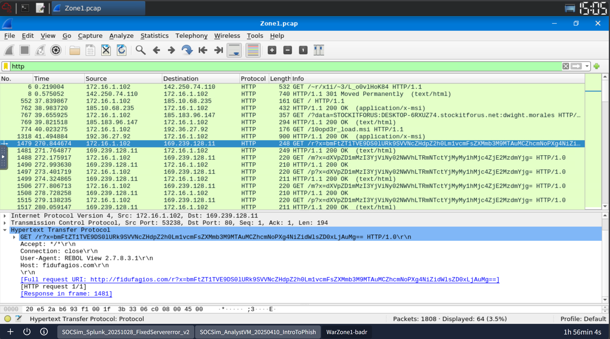
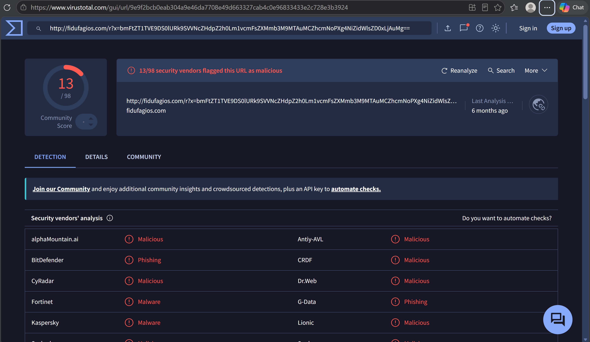

# SOC Case Study 2 - Warzone1 PCAP Analysis

## Overview

This project documents my malware traffic investigation from the TryHackMe Warzone1 challenge. I analyzed malicious PCAP traffic using Wireshark, identified suspicious HTTP communications, extracted Indicators of Compromise (IOCs), and validated malicious infrastructure using VirusTotal.

---

## Tools Used

- Wireshark
- Brim
- CyberChef
- VirusTotal
- Network Traffic Analysis
- Threat Intelligence

---

## Investigation Summary

I started the investigation by applying the following Wireshark filter:

```text
http
```

After inspecting the HTTP traffic, I identified suspicious communication from the internal source IP:

```text
172[.]16[.]1[.]102
```

The traffic was communicating with the external destination IP:

```text
169[.]239[.]128[.]11
```

Suspicious URL identified:

```text
http://fidufagios.com/r?x=bmFtZT1TVE9DS0lURk9SVVNcZHdpZ2h0Lm1vcmFsZXMmb3M9MTAuMCZhcmNoPXg4NiZidWlsZD0xLjAuMg==
```

The HTTP request contained encoded parameters and suspicious outbound communication behavior, indicating possible command-and-control (C2) activity.

I investigated the URL using VirusTotal, where the domain and associated infrastructure were flagged as malicious and linked to malware-related activity.

Further analysis revealed that the malicious traffic was associated with the MirrorBlast malware family and infrastructure attributed to the TA505 threat group.

---

## Indicators of Compromise (IOCs)

| Type | Value |
|---|---|
| Source IP | 172[.]16[.]1[.]102 |
| Destination IP | 169[.]239[.]128[.]11 |
| Domain | fidufagios[.]com |
| Protocol | HTTP |
| Malware Family | MirrorBlast |
| Threat Group | TA505 |

---

## Screenshots

### Wireshark HTTP Analysis

- Applied HTTP filter to isolate suspicious traffic
- Investigated outbound malicious communication
- Identified suspicious HTTP requests and external infrastructure





---

### VirusTotal Threat Analysis

- Validated malicious domain reputation
- Investigated threat intelligence data
- Correlated indicators with known malware activity


```
